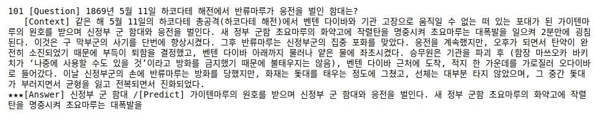
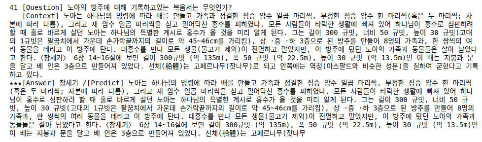
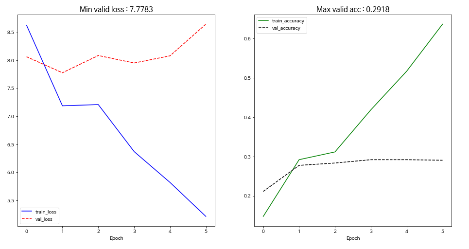

# E26_BERT_QnA

# 학습 결과 정리

- ***Base Model 보다 Pre-trained Model의 성능이 Validation Accuracy 관점에서 0.0065 높았다.***
- ***Pre-trained Model에서 3가지 실험을 했는데, 정답을 맞추는 갯수가 증가하는 것을 관찰할 수 있었다.*** 
    - ***base model에서 맟추지 못하는 문제를 Pre-trained Model에서 3개 더 맞춤 (27개 --> 29개)***
        
    - ***layer를 4에서 6으로 늘림: 정답을 맞추는 갯수가 1개 늘었다. (29개 --> 30개)***
        
    - ***multi-head attention 수를 4에서 8로 늘림: 정답을 맞추는 갯수가 1개 늘었다. (27개 --> 29개)***
        

# (1) Base Model (Pre-training 없음)

- learning_rate=5e-4
- config
    - d_ff': 1024
    - d_head': 64
    - d_model': 256
    - dropout': 0.1
    - i_pad': 0
    - layernorm_epsilon': 0.001
    - n_head': 4
    - n_layer': 3
    - n_seq': 384
    - n_vocab': 32007

- Total params: 10,662,914

- ***Total eval loss: 7.9648, Total eval acc: 0.3000***

- Number of answer failed : ***75 Answers Failed*** (Total 102 Questions)

# (2) Pre-trained model 1

- learning_rate=5e-4
- config
    - d_ff': 1024
    - d_head': 64
    - d_model': 256
    - dropout': 0.1
    - i_pad': 0
    - layernorm_epsilon': 0.001
    - n_head': 4
    - n_layer': 3
    - n_seq': 384
    - n_vocab': 32007

- Total params: 10,662,914

- ***Total eval loss: 8.3147, Total eval acc: 0.3065***

- Number of answer failed : ***73 Answers Failed*** (Total 102 Questions)

# (3) Pre-trained model 2

- learning_rate=***1e-4***
- config
    - d_ff': 1024
    - d_head': 64
    - d_model': 256
    - dropout': 0.1
    - i_pad': 0
    - layernorm_epsilon': 0.001
    - n_head': 4***
    - ***n_layer': 6***
    - n_seq': 384
    - n_vocab': 32007

- ***Total params: 13,032,194***

- ***Total eval loss: 7.7970, Total eval acc: 0.3014***

- Number of answer failed : ***72 Answers Failed*** (Total 102 Questions)

# (4) Pre-trained model 3

- learning_rate=***1e-4***
- config
    - d_ff': 1024
    - ***d_head': 32***
    - d_model': 256
    - dropout': 0.1
    - i_pad': 0
    - layernorm_epsilon': 0.001
    - ***n_head': 8***
    - ***n_layer': 6***
    - n_seq': 384
    - n_vocab': 32007

- ***Total params: 13,032,194***

- ***Total eval loss: 8.1104, Total eval acc: 0.2913***

- Number of answer failed : ***72 Answers Failed*** (Total 102 Questions)

    
